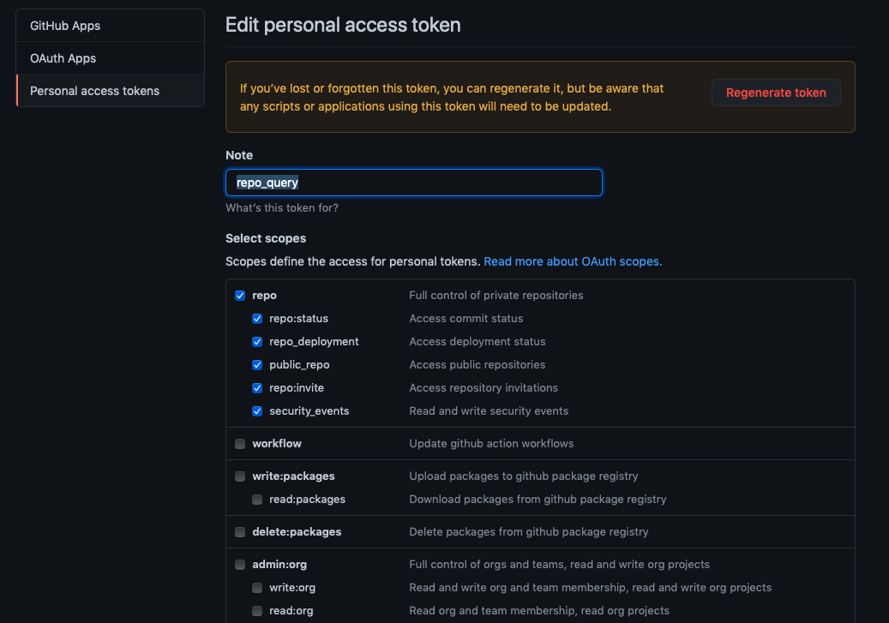

# hcl-labs-ospo.github.io

This is a sample GitHub Pages landing page that:
- provides a GitHub Data Retriever Node.js app to generate JSON files with content from a GitHub organisation
- provides a landing page that:
  - displays the public repos in that organisation
  - allows filtering on tags
  - allows searching of returned content

## GitHub Data Retriever

This is self-contained in the githubDataRetriever directory of the repo.

This does a GraphQL query of GitHub and parses the content. The files are outputted to the _data directory as JSON files. See [Running the Code](#running-the-code) for details.

### GitHub GraphQL Queries

You can test GraphQL GitHub queries in the [GraphQL explorer](https://docs.github.com/en/free-pro-team@latest/graphql/overview/explorer) and there is also [full documentation ](https://docs.github.com/en/free-pro-team@latest/graphql/reference/objects).

The "search" query does not appear to return repositories that are forks. So instead the "organization" query is used instead.

### GitHub Personal Token

To perform GraphQL queries, you will need a personal GitHub token that has access to run the query. Personal Tokens are created in your GitHub Settings, under Developer Settings. The token will require access to private repos to include non-public repos. Follow the instructions in the [GitHub Docs](https://docs.github.com/en/free-pro-team@latest/github/authenticating-to-github/creating-a-personal-access-token).

The settings I have used are shown in the screenshot below. If you only want to access public repos, you can just tick the "public_repo" scope.

You will need to make a note of the token and pass it in as an environment variable when running the program.

### Running the Code

Open a Terminal window in the "githubDataRetriever" directory. If you have not yet done so, issue the command `npm install` to download the node modules required.

With a note of your personal GitHub token and the organisation you want to retrieve content for, issue the command:

`GITHUB_TOKEN=XXXXX ORG=YYYYY node index.js`

replacing `XXXXX` and `YYYYY` with your actual github token and organisation.

This will run the code in index.js, passing in the environment variable. The code will use this via `process.env.GITHUB_TOKEN` and `process.env.ORG`. If the query is still correct, it will generate three files in "_data" directory:
- **repoData.json** contains one entry per repo, with repo details and topics.
- **repoDataPublic.json** contains one entry per PUBLIC repo, with repo details and topics.
- **repoTopics.json** is the same data, sliced by topic instead of repo. It contains one entry per topic, with entries for each repo that has that topic.

#### Code Structure

- `processQuery` is a constant function that calls the GraphQL function and processes the response, recursively calling itself if there is another page of results.
- `writeToFile` is an async function that is the main function, calling `processQuery` and generating files from the generated JSON objects.
- `doQuery` is an async function that makes an axios request to GitHub for a specific number of repositories in HCL-TECH-SOFTWARE organisation at a specific starting point. **NOTE** it is hard-coded to only return a maximum of 10 (TEN) topics.

## GitHub Pages Site

The GitHub Pages site can be previewed as for any normal GitHub Pages site. The "index.html" page uses the `default.html` layout. There are links to specific product pages, also at the top level, which use the `product.html` layout. The main differences between the two are:
- links to product pages vs link back to home
- cards are built from `_data/repoDataPublic.json` vs a specific topic in `_data/repoTopics.json`.

### Search Content

#### _includes/searchUI.html

The UI for searching and filtering is in `searchUI.html`. This comprises of:
- a search inputbox
- a button group of topics

#### _includes/searchCode.html

The code for searching is in `searchCode.html`. It also relies on jQuery, loaded in the `head.html`. Filtering and searching is done using [Isotope](https://isotope.metafizzy.co/extras.html).

On click of a filter button (topics), an isotope filter extracts the `data-filter` attribute for all topics with a css class `active` and filters the grid based on those cards with a CSS class that matches. A card must match **ALL** active buttons. See the Isotope documentation if you want to change that to an OR match (the join would be `", "` instead of `""`).

On keyup of the search input, an isotope filter is done across all the text in a card.

On click on a filter button (topics), the `active` class is toggled for the current button.

A `debounce()` function is used to delay searching in the `keyup` event.

### Cards

The cards are placed in a `div` with a class `grid`. This is the specific area the search code acts upon. 

If the repo is a fork, a Liquid variable `fork` is assigned with a value of " fork". This is then added to the CSS class of the card. The variable is scoped to the whole forall, not an individual loop, so it's important we reset the `fork` variable if the repo is not a fork.

The topics for a repo are also added as CSS classes.